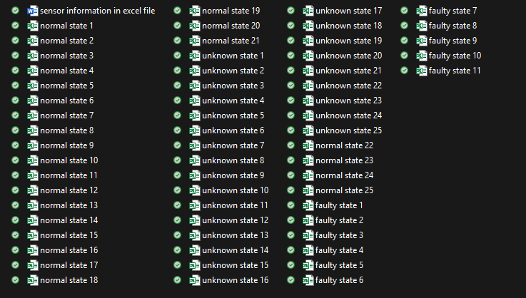

# Dataset Organisation
* The data retrived form the source was acculmulated in one floder. 
* To organise and format this code a one time script was created in MATLAB.
* This was done using code since it would manually be an exhaustive process and subject to erros that could corrupt data.

*Figure1: Shows how the data retrieved form source was organised*

## Script Used
* [Jump to file](Combining_Data.md)

# Combined Data
* The entire dataset was combined in 3 excel tables (.xlsx files).

*Figure 2: Shows the 3 files created after data from the 3 states were combined into a single file*
