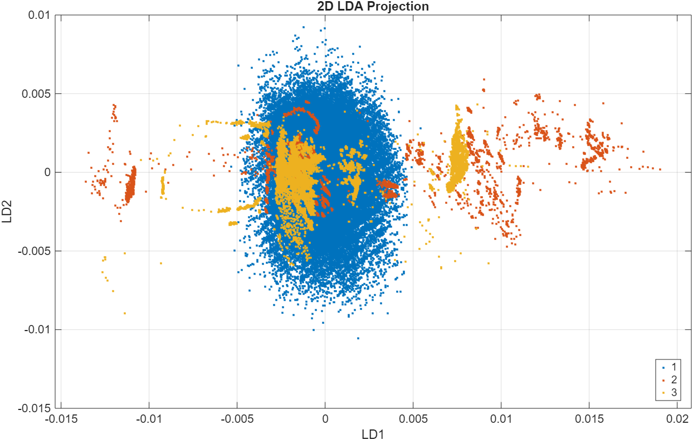

# Fisher's Discriminant Analysis
* Method introduces by **Ronald Fisher** that aims to *find the projection that maximizes separation between different classes.
    * Maximizes Inter-Class Variance
    * Minimizes Intra-Class variance
* Reduced Dimension = No. of Classes - 1
    * therefore our dataset will be 2 columns

# Scatter Plot of 2 Components

*Figure 01: Shows the Plot of LDA projections visually separated by class*

The classes normal, faulty and unknown are represented int he figure above by labels 1, 2, and 3 and colored blue, red, yellow respectively.

# Conclusion
The Fishers Discriminant analysis or Linear discriminant analysis, produces 2 projects for the 3 class data. this projection greatly reduces the dimension of the original data. This is expected as unlike **PCA** which preserves that variance in the original dataset **FDA** tries to:
    * maximize between class variance
    * minimize within class variance.
Therefore, LDA is not trying to re-create the entire dataset but rather maximize the class separability.

Considering the *scatter plot* we can observe that there is overlap between classes,This indicates that the projections are less representative of the dataset. thus, the classes cannot be linearly separated.

To address nonlinearity **kernel FDA** can be applied.

To add on, a simple analysis of the **discriminative power** of the 2 projections yielded 

    * FDA Component 1 explained power: 99.79%
    * FDA Component 2 explained power: 0.14%

---